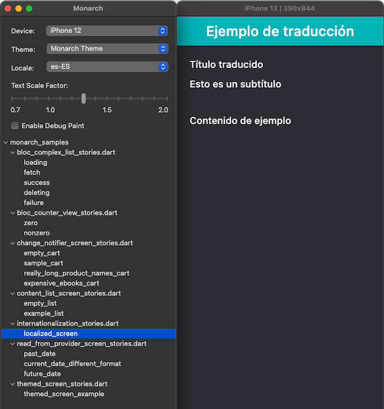

# monarch_samples

Monarch sample code and stories.

_Monarch is a tool for Flutter developers. It makes building beautiful widgets a more pleasant and faster experience. Find out more at https://monarchapp.io_

This repo provides examples of using Monarch with the following patterns:
- bloc
- cubit
- lists
- internationalization
- provider
- change notifier
- themes
- dialogs

## Running the sample stories

1. Make sure you already have Monarch [installed](https://monarchapp.io/docs/install).
2. Clone this repo onto your local
3. `flutter pub get`
4. `monarch run`

Once the Monarch UI launches, you can start exploring and playing with the sample stories and code. You should see something like the screenshots below.

    
## importing stories into widget tests

You can import stories into widget tests and verify expected behavior.
Call the function returning your widget from the test.
Then you can search your widget for visible components using [Finders](## Running the sample stories) and verify its state by using [matchers](https://flutter.dev/docs/cookbook/testing/widget/introduction#6-verify-the-widget-using-a-matcher)
Testing FAQ:

#-how to run tests?
- Type 

    `flutter test test/obscured_single_value_text_field_test.dart.dart` 
    
    into terminal or run tests from IDE

    Android Studio
    
    
    Visual Studio Code
    
    
#-I got a "No Material widget found." error from running tests
- Some widgets require material widget ancestors to run. If your story has TextField or other Material Widget,
 you have to wrap it with 
 
    `MaterialApp(home: Scaffold(body: YourWidget())) `
    
see stories/statefull_widget_obscured_text_input_stories.dart file
